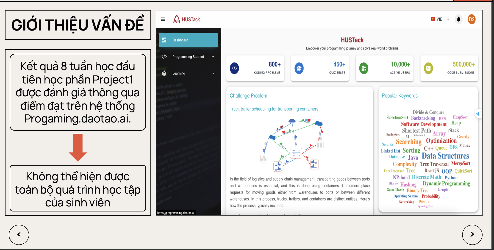
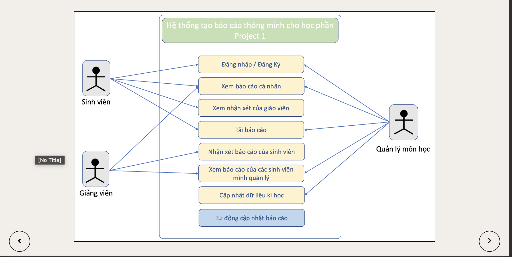
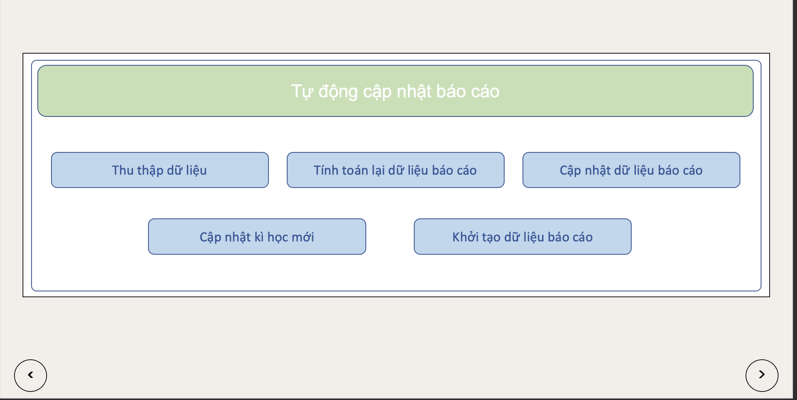
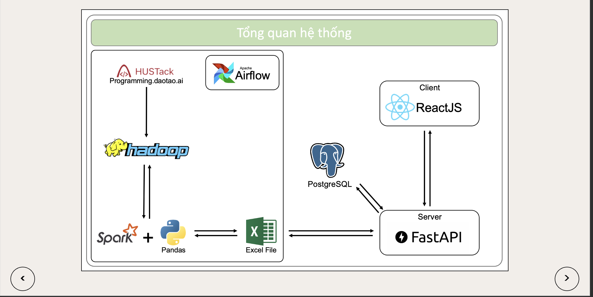
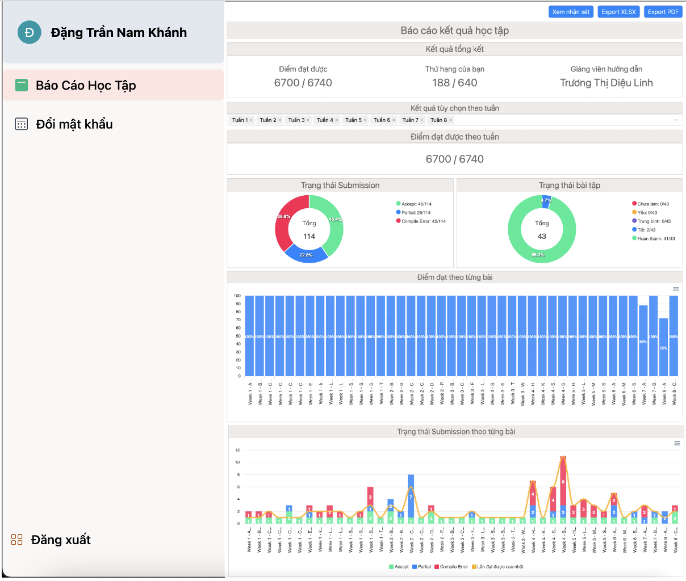
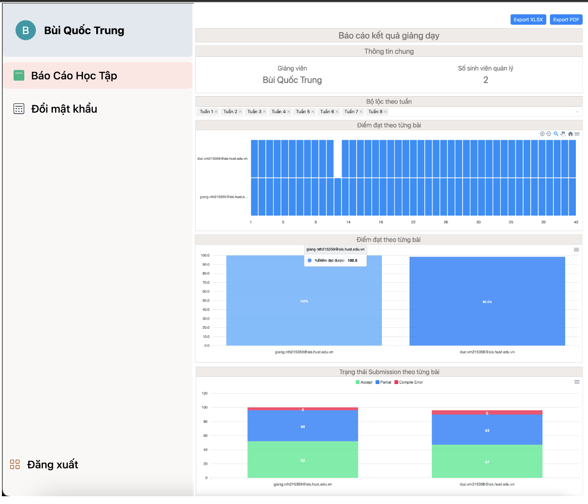
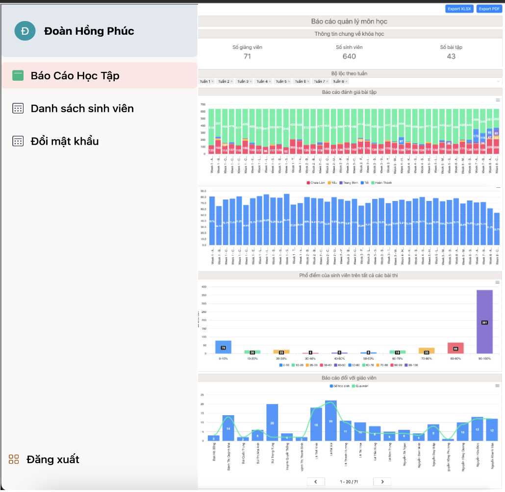

# Intelligent Report Generation System Supporting The Project 1 Course.

     
     
    
    
    

# Overview

# Use-case

# Activity diagram

# Output

## Student Report

## Teacher Report

## Manager Report

